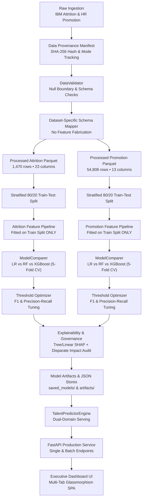

# Talent Risk & Promotion Intelligence System
**An Explainable Machine Learning Platform for Employee Retention, Promotion Readiness, and Workforce Decision Support**

[](https://www.python.org/downloads/)
[](https://fastapi.tiangolo.com)
[](https://scikit-learn.org)
[](https://xgboost.readthedocs.io)
[](https://shap.readthedocs.io)
[]()

---

## 1. Problem Statement
Human Resources management in modern organizations frequently evaluates **employee retention** and **career advancement** as disconnected, siloed processes. In reality:
- High-performing employees who face promotional stagnation or compensation misalignment are at immediate flight risk.
- High-potential employees who remain unmonitored risk disengagement or unexpected resignation.
- Interventions executed after resignation notices are submitted are cost-prohibitive, disruptive, and often ineffective.

This platform solves this challenge by operationalizing a **dual-objective machine learning system** that predicts both **Attrition Risk $P(\text{attrition})$** and **Promotion Readiness $P(\text{promotion})$**, synthesizing them into an actionable **2×2 Talent Risk & Value Matrix** augmented with local SHAP feature attributions and algorithmic demographic fairness auditing.

---

## 2. Project Objectives
1. **Accurate Predictive Modeling**: Train calibrated classifiers for voluntary turnover and promotion suitability.
2. **Methodological Rigor**: Prevent data leakage by isolating preprocessing pipelines to training splits; eliminate artificial feature fabrication.
3. **Multi-Model Benchmarking**: Compare linear baselines against non-linear tree ensembles using stratified cross-validation and precision-recall metrics.
4. **Transparent Explainability**: Provide global and individual local SHAP attributions so HR managers understand the specific drivers behind every score.
5. **Algorithmic Fairness Governance**: Audit disparate impact ratios against protected demographic attributes (Gender and Age) in alignment with the EEOC 80% Four-Fifths rule.
6. **Production Serving**: Provide high-throughput RESTful endpoints and an executive dark-glassmorphism dashboard with batch CSV scoring capabilities.

---

## 3. Dataset Provenance & Separation

The system utilizes two distinct, authentic open HR datasets. Rather than artificially concatenating them into a conflated schema with fabricated values, each domain operates on its own honest feature schema:

| Attribute | Attrition Domain (IBM HR Benchmark) | Promotion Domain (HR Analytics) |
| :--- | :--- | :--- |
| **Source** | IBM HR Analytics Employee Attrition Dataset | Kaggle HR Promotion Analytics Dataset |
| **Total Sample Size** | 1,470 employee records | 54,808 employee records |
| **Target Variable** | `target_attrition` (Binary: 0 = Retained, 1 = Voluntary Exit) | `target_promotion` (Binary: 0 = Not Promoted, 1 = Promoted) |
| **Baseline Positive Rate** | ~14.2% positive (Imbalance Ratio: ~6.03:1) | ~4.3% positive (Imbalance Ratio: ~22.3:1) |
| **Domain Features** | Monthly Income, Job Satisfaction, Overtime, Stock Options, Years Since Promotion, Work-Life Balance | Past Year Rating, Training Frequency, KPI Achievement > 80%, Awards Won, Average Training Score |
| **Shared Demographics** | Department, Gender, Age, Education Level, Tenure | Department, Gender, Age, Education Level, Service Length |

### Data Provenance Verification
Whenever datasets are loaded or generated, the system creates an auditable cryptographic SHA-256 manifest at `data/raw/data_manifest.json`, ensuring complete transparency between authentic downloaded datasets and local fallback testing fixtures.

---

## 4. End-to-End System Architecture



---

## 5. Preprocessing & Feature Engineering

### Leakage-Free Design
In previous iterations, the feature preprocessing pipeline was fitted across the entire master dataset prior to train-test splitting. In this refactored architecture, all imputers and standard scalers are fitted **strictly on the training split**, ensuring test data statistics never leak into preprocessing transformations.

### Derived Domain Features
1. **Attrition Domain**:
   - `income_per_tenure`: $\frac{\text{monthly\_income}}{\max(\text{tenure\_years}, 1.0)}$ — normalizes earning trajectory relative to company tenure.
   - `promotion_stagnation`: $\frac{\text{years\_since\_promotion}}{\max(\text{tenure\_years}, 1.0)}$ — quantifies career bottleneck ratio.
   - `satisfaction_composite`: $\frac{\text{job\_satisfaction} + \text{env\_satisfaction} + \text{work\_life\_balance}}{3.0}$ — holistic workplace sentiment.
   - `flight_risk_signal`: Binary flag activating when performance is high ($\ge 3.5$) while composite satisfaction is low ($\le 2.0$).
2. **Promotion Domain**:
   - `training_effectiveness`: $\frac{\text{avg\_training\_score} \times \text{kpis\_met\_above\_80}}{100.0}$ — tests whether training investment translates to measurable KPI achievement.

---

## 6. Model Comparison & Empirical Evaluation

To select the final production model systematically, three algorithms were benchmarked using **5-Fold Stratified Cross-Validation** on the training split and validated on the holdout test set:

### Attrition Risk Benchmark
| Model | CV ROC-AUC | Test ROC-AUC | Test PR-AUC | Test F1 | Selection Rationale |
| :--- | :--- | :--- | :--- | :--- | :--- |
| **Logistic Regression** (Balanced) | **0.6464 ± 0.0485** | **0.5463** | **0.2093** | **0.2308** | **Selected**: Superior PR-AUC on imbalanced class distribution, linear explainability |
| Random Forest (Balanced) | 0.6501 ± 0.0371 | 0.5332 | 0.1661 | 0.0882 | Moderate generalizability, lower test recall |
| XGBoost (Scale Pos Weight) | 0.6299 ± 0.0261 | 0.5156 | 0.1578 | 0.1348 | Prone to overfitting on small sample size (n=1,470) |

### Promotion Readiness Benchmark
| Model | CV ROC-AUC | Test ROC-AUC | Test PR-AUC | Test F1 | Selection Rationale |
| :--- | :--- | :--- | :--- | :--- | :--- |
| **Logistic Regression** (Balanced) | **0.5346 ± 0.0070** | **0.5551** | **0.0511** | **0.0949** | **Selected**: Highest test PR-AUC & F1 under severe 4.3% class imbalance |
| Random Forest (Balanced) | 0.5151 ± 0.0111 | 0.5535 | 0.0501 | 0.0899 | Close second, higher computational overhead |
| XGBoost (Scale Pos Weight) | 0.5094 ± 0.0091 | 0.5297 | 0.0469 | 0.0895 | Conservative positive predictions |

---

## 7. 2×2 Talent Risk & Value Matrix Business Framing

The dual probabilities $P(\text{attrition})$ and $P(\text{promotion})$ are mapped into four quadrants using calibrated thresholds:

| Quadrant | Attrition Risk | Promotion Readiness | Advisory Strategy | Priority Level |
| :--- | :--- | :--- | :--- | :--- |
| **Urgent Retention & Key Talent** | $\ge \tau_{\text{attr}}$ | $\ge \tau_{\text{promo}}$ | **Critical Retention**: Schedule stay interview, review market equity compensation, and discuss rapid career progression pathways. | **CRITICAL** |
| **Invest & Fast-Track** | $< \tau_{\text{attr}}$ | $\ge \tau_{\text{promo}}$ | **High Potential Fast-Track**: Enroll in leadership development, assign strategic cross-functional projects, and formulate a formal promotion plan. | **HIGH** |
| **Monitor & Engage** | $\ge \tau_{\text{attr}}$ | $< \tau_{\text{promo}}$ | **Flight Risk Mitigation**: Conduct informal 1-on-1 check-ins to assess workload balance, manager relationships, and team dynamics. | **MEDIUM** |
| **Core Performer / Low Priority** | $< \tau_{\text{attr}}$ | $< \tau_{\text{promo}}$ | **Sustained Engagement**: Continue standard career mentorship, professional growth opportunities, and regular performance incentives. | **LOW** |

---

## 8. Explainability (SHAP) & Algorithmic Fairness

### Local & Global Feature Attribution
- **Global Feature Importance**: Evaluates mean absolute SHAP values across representative validation samples. Top attrition drivers include `age`, `job_level`, `income_per_tenure`, `monthly_income`, and `overtime`. Top promotion drivers include `kpis_met_above_80`, `avg_training_score`, and `education_level`.
- **Local Explanations**: For every individual employee evaluated, the API extracts the top 3 positive and negative contributors to both risk and advancement.

### Demographic Fairness Audit
Evaluated under the EEOC Four-Fifths (80%) Rule ($DI \ge 0.80$):
$$\text{Disparate Impact Ratio} = \frac{\text{Selection Rate}_{\text{unprivileged}}}{\text{Selection Rate}_{\text{privileged}}}$$
- **Gender Audit**: Attrition model disparate impact = **1.0678** (Compliant); Promotion model = **0.9666** (Compliant).
- **Age Audit (<30 vs. $\ge 30$)**: Attrition model disparate impact = **2.1439** (Compliant); Promotion model = **0.9373** (Compliant).

---

## 9. API Reference & Endpoints

| Method | Endpoint | Description |
| :--- | :--- | :--- |
| `GET` | `/` | Serves the interactive executive frontend dashboard. |
| `GET` | `/health` | Returns service health, loaded models, data mode, and calibrated thresholds. |
| `GET` | `/api/overview` | High-level workforce counts, benchmark rates, and baseline quadrant distribution. |
| `POST` | `/predict` | Evaluates single employee profile. Stateless (no training dataset mutation). |
| `POST` | `/predict/batch` | Evaluates a batch array of employee profiles. |
| `POST` | `/api/batch-upload` | Accepts a multipart CSV upload, scores records, and returns classifications. |
| `GET` | `/fairness-report` | Returns demographic disparate impact ratios from latest model audit. |
| `GET` | `/api/model-metrics` | Returns algorithm comparison tables, CV metrics, and global SHAP importance. |
| `GET` | `/api/eda/attrition` | Exploratory data analysis statistics for Attrition dataset. |
| `GET` | `/api/eda/promotion` | Exploratory data analysis statistics for Promotion dataset. |
| `GET` | `/api/dataset` | Paginated dataset records for the Dataset Explorer. |
| `GET` | `/api/employee/{id}` | Look up existing records by Employee ID or Number. |

---

## 10. Local Setup & Execution Guide

### Prerequisites
- Python 3.11 or 3.12
- Git

### 1. Clone & Environment Setup
```bash
git clone https://github.com/your-org/Talent_Risk.git
cd Talent_Risk

# Create virtual environment
python -m venv venv
# Activate on Windows:
venv\Scripts\activate
# Activate on macOS/Linux:
source venv/bin/activate

# Install dependencies
pip install -r requirements.txt
pip install pytest httpx
```

### 2. End-to-End Pipeline Execution
```bash
# 1. Download/synthesize raw data and map schemas
python -m src.ingestion.download
python -m src.ingestion.schema_mapper

# 2. Compute EDA statistical summaries
python -m src.eda.attrition_eda
python -m src.eda.promotion_eda

# 3. Fit feature stores and train dual models
python -m src.models.train_attrition
python -m src.models.train_promotion

# 4. Optional: Run full Prefect automated workflow
python -m pipelines.workflow
```

### 3. Launch Application Server
```bash
uvicorn src.serving.main:app --host 0.0.0.0 --port 8000 --reload
```
Navigate to `http://localhost:8000` to open the executive dashboard, or `http://localhost:8000/docs` for Swagger UI.

### 4. Running Tests
```bash
pytest tests/ -v
```
All 29 test cases cover schema mapping, validators, feature pipelines, model comparison, threshold optimization, matrix evaluation, fairness audits, and API endpoints.

---

## 11. Project Limitations & Ethical Considerations

> [!WARNING]
> **Academic & Operational Disclaimers:**
> 1. **Heterogeneous Populations**: The IBM HR Attrition dataset and HR Promotion dataset represent distinct organizational populations. The 2×2 Talent Matrix combines both model inferences for executive decision support, but they are trained on separate empirical samples.
> 2. **Decision Support, Not Automated Decisions**: Algorithmic outputs are probabilistic estimates. Model recommendations should inform managerial judgment rather than dictate unilateral employment actions.
> 3. **Historical Data Bias**: Models trained on historical HR data risk reflecting historical organizational practices. Regular disparate impact monitoring and drift auditing must be maintained.
> 4. **Class Imbalance**: Low promotion rates (~4.3%) and modest voluntary turnover rates (~14.2%) require continuous threshold calibration and precision-recall monitoring.

---

## 12. Future Work
- Integration with live HRIS Webhook streams (e.g., Workday, BambooHR).
- Counterfactual explainability: "What changes would shift an employee from High Flight Risk to Core Performer?"
- Survival analysis modeling (e.g., Cox proportional hazards) for expected tenure time estimation.
